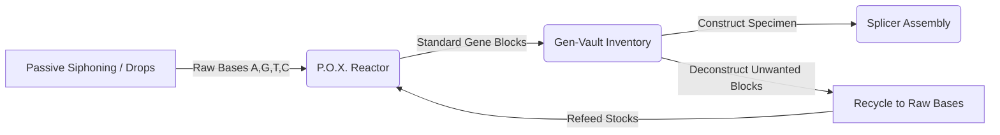

# Bio-Lab P.O.X. Reactor: Comprehensive Guide

Welcome to the **Bio-Lab P.O.X. Reactor (Tide Pool Reactor)** operations and development manual. This document provides a comprehensive overview of the reactor's biophysical mechanics, chemical controls, and mathematical simulation algorithms designed for both players and developers.

---

## 1. Core Concept & Gameplay Loop

The P.O.X. Reactor is the baseline biological refinery of the GENPOX network. Its primary purpose is to synthesize **Standard Gene Blocks** (8-base-pair DNA segments) from raw nucleotide feedstocks. These gene blocks are stored in the player's genetic inventory and later combined in the Splicer to construct functional creature genomes.

### Manual Target Programming & Stepped Transcription
Rather than running in the background, standard synthesis is a deliberate, high-stakes manual process:
1. **Target Sequencing**: The player dials in a custom 8-base target sequence via interactive dials.
2. **Pre-Flight Wave Tuning**: Telemetry displays the target's ideal melting temperature ($T_m$) and secondary structure folding energy ($MFE$). The player must adjust the temperature slider to phase-lock the dynamic environment wave with the target's frequency signature (merging them into a CyberGreen line).
3. **Manual Ignition**: Tapping **`✕ INITIATE SYNTHESIS`** consumes the feedstock and starts the transcription cycle (8s for Taq, 16s for Tth, 24s for Pfu).
4. **Catastrophic Reaction Collapse**: At each step, if the chamber drops outside safe thermodynamic limits (GC Hairpin stalling or AT Denaturation) without protective solutes (DMSO or Netropsin), the reaction collapses catastrophically. The cycle aborts, no gene block is created, and all feedstock is lost—converted instead into **Bio-Waste**.

### The Genetic Economy Loop

---

## 2. Reactor Controls & Chemical Tuning

The reactor console features interactive sliders and selectors allowing players to adjust chemical solute levels, enzymes, and temperature variables to target specific genetic structures.

### Temperature ($T_{\text{react}}$)
- **Range**: $15^\circ\text{C}$ to $95^\circ\text{C}$.
- **Thermomechanical Effects**: Modulates which base pairings survive.
  - **High Temperature ($> 75^\circ\text{C}$)**: Induces thermal stress. Selects for stable GC-rich sequences. However, AT-rich strands will **denature (melt apart)** unless stabilized by **Netropsin**.
  - **Low Temperature ($15^\circ\text{C} - 30^\circ\text{C}$)**: GC-rich strands tend to form stable secondary folds (hairpins) that block polymerase progression (**GC Hairpin Stalling**). This thermodynamic trap is avoided if **DMSO** is added. Otherwise, AT-rich strands are naturally favored.

### Salt Concentration ($[Na^+]$)
- **Range**: $0.01\text{ M}$ ($10\text{ mM}$) to $0.50\text{ M}$ ($500\text{ mM}$).
- **Effect**: Shifts the overall melting temperature ($T_m$) of the DNA strands. Higher salt concentrations neutralize the negative charge on the DNA backbone, stabilizing double helices and raising the effective $T_m$.

### Polymerase Chamber Selector
The selected polymerase enzyme dictates cycle speed, copy fidelity, and mutation discovery rates:
*   **Taq Polymerase**: Fast cycles (**8 seconds**). Lacks proofreading (low Phred $Q$-scores of $15-25$), yielding high mutation frequencies that help discover new sequences.
*   **Tth Polymerase**: Medium cycles (**16 seconds**). Moderate fidelity (Phred $Q$-scores of $25-33$) and high thermal stability, optimal for hot GC-runs.
*   **Pfu Polymerase**: Slow cycles (**24 seconds**). Proofreading active, extremely high fidelity (Phred $Q$-scores of $35-40$) to duplicate stable templates without alterations.

### Chemical Solutes
Solutes act as protective buffers to override biophysical limits:
*   **DMSO (Dimethyl Sulfoxide)**: GC-destabilizer. Added to prevent **GC Hairpin Stalling** in cold chambers ($< 30^\circ\text{C}$).
*   **Netropsin**: AT-stabilizer. Binds to the minor groove of AT-rich DNA to prevent **AT Denaturation** in hot chambers ($> 75^\circ\text{C}$).

### Inlet Sliders ($I_A, I_G, I_T, I_C$)
- **Purpose**: Adjusting these sliders controls the raw base feed rate into the reaction chamber.
- **Inlet Deprivation Collapse**: In the manual synthesizer, if any base required by the target sequence has its inlet ratio restricted to $\le 5\%$, the reactor will suffer from inlet deprivation, collapsing the reaction catastrophically.

---

## 3. Biophysical Simulation Mechanics

The reactor runs on deterministic mathematical formulas representing true molecular biology dynamics.

### Wallace-Breslauer Melting Temperature ($T_m$)
Evaluates the temperature at which $50\%$ of the current growing DNA strand denatures:
$$T_m = 2 \cdot N_{\text{AT}} + 4 \cdot N_{\text{GC}} - 16.6 \cdot \log_{10}\left(\frac{0.05}{[\text{Salt}]}\right)$$
*   $N_{\text{AT}}$: Total count of A/T bases in the sequence.
*   $N_{\text{GC}}$: Total count of G/C (and anomalous) bases.

### Nussinov Secondary Structure Energy ($MFE$)
To determine folding stability and hairpin stalling, the engine runs a Nussinov dynamic programming algorithm on the single-stranded sequence to calculate its **Minimum Free Energy (MFE)**.
- **Base Pair Strengths**: G-C pairs are assigned $-3.0\text{ kcal/mol}$ (3 hydrogen bonds), A-T pairs are assigned $-2.0\text{ kcal/mol}$ (2 hydrogen bonds), and anomalous X-Y pairings are assigned $-4.0\text{ kcal/mol}$.
- Loops smaller than 3 bases are prevented. The resulting $MFE$ represents the thermodynamic drive to form a secondary fold; a highly negative value ($\le -5.0\text{ kcal/mol}$) indicates a tight fold that risks stalling polymerase translation.

### Phred Quality Score ($Q$)
A metric representing synthesis precision:
*   Standard base accuracy is modeled on the selected enzyme's fidelity.
*   If raw stock for a base runs dry during a cycle, the reactor performs **Base Substitution** (substituting an available base). This penalizes the Phred score of the block by **$-15.0$** (clamped to a minimum of $5.0$), indicating a high-error template.
*   Biophysical failures (unstabilized Stalling or Denaturation) scramble the block and reset its $Q$-score to $5.0$.
*   **Incremental Calculation**: The Q-Score updates at each transcription step as a running average of the base-by-base synthesis quality, modulated by thermal matching efficiency.

### Codon Adaptation Index ($CAI$)
During creature construction, the 64-character genome (compiled from 8 reactor blocks) is evaluated against faction-specific codon usage tables:
*   Factions have target nucleotide biases: **Infection** ($A$), **Mech** ($G$), **Parasite** ($T$), **Containment** ($C$).
*   The geometric mean of codon weights (ranging from $0.2$ to $1.0$ depending on target base content) produces the $CAI$. A high $CAI$ indicates high translation efficiency, scaling the creature's combat stats.

---

## 4. Operational Protocols

### 1. Passive Siphoning (Resolving starting locks)
When a player starts with $0$ bases and $0$ creatures, standard synthesis is impossible. The reactor activates **Passive Nutrient Siphoning** which deposits raw bases directly into stockpiles every five seconds.
- **Planetary Resonance**: Daily synodic waves synchronized with the moon phase boost siphoning yields for specific bases (e.g. `A` and `T` wave) using wave multipliers (ranging from $1.1\text{x}$ to $1.6\text{x}$).

### 2. Deconstruction and Recycling
Unneeded standard gene blocks can be recycled inside the Vault tab. 
- Recycling deconstructs the 8-base block, yielding **+1 raw base** for each respective letter in the sequence.
- *Note: Anomalous blocks are too structurally complex and cannot be recycled.*

### 3. Bio-Waste Management
Catastrophic collapses in standard synthesis generate **Bio-Waste** (+8 units per collapse). Bio-Waste accumulates as a stockpile resource next to raw feedstock reserves, documenting player mistakes.

### 4. Alternative Mode: Anomaly Unstable Fusion
By toggling off standard operations, players can engage the **Anomaly Engine** to hunt for volatile non-standard blocks containing `X, Y, Z, W, ?, !, $, %, &, @, #`.
- **Requirements**: Requires a starting threshold of $250,000$ total bases and consumes $2,500$ of each base ($10,000$ total bases) per cycle.
- **Success Rate**: Logarithmic scaling that increases with cumulative bases consumed in the current active run. If successful, it yields a rare anomalous block with a perfect Phred score ($40.0$). If unsuccessful, the bases decay into bio-waste.
