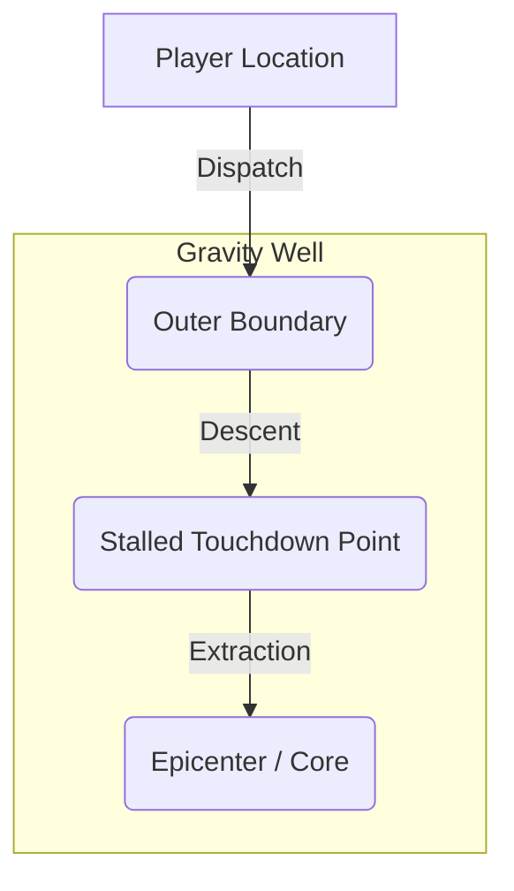

# GENPOX: Deep Investigation Report on Anomalies
## Theoretical Physics, Spawning Mechanics, Lifecycles, and Genetic Behaviors of Cosmic Anomalies

This document compiles a comprehensive, multi-layered technical investigation into the anomaly physics engine of **GENPOX**. It covers the spawning routines, mathematical formulations, orbital and environmental modifiers, mission lifecycle phases, and the lab-synthesized anomalous genetics system.

---

## 1. Executive Summary & Core Definitions

In the GENPOX universe, **Anomalies** (`PoxAnomaly`) represent localized cosmic disruptions or gravitational wells containing highly volatile, non-standard genetic material. These wells attract harvesters (spliced creatures) which descend into their depths to siphon alien gene sequences.

*   **Standard Genes**: Linear sequences composed of standard nucleotides: `A`, `G`, `T`, `C`.
*   **Anomalous Genes**: Volatile sequences containing non-standard alien characters: `X`, `Z`, `Y`, `W`, `?`, `!`, `$`, `%`, `&`, `@`, `#`.
*   **The Gravity Well & Boundary**: Each anomaly projects a forcefield boundary (characterized by its *Boundary Radius* $R(\theta)$) that repels harvesters. Harvesters must possess sufficient *Defense* ($D_{\text{eff}}$) to pierce the boundary and sink toward the epicenter (*Touchdown point*).
*   **Genetic Mutation Decay**: Radiation within the gravity well degrades the harvester's genetic code, triggering random base mutations during transit and extraction.
*   **Crosstalk (Hybridization)**: When two anomaly boundaries overlap, their field interference allows genes to splice/stitch together dynamically during recovery.

---

## 2. Spawning Mechanics & Spatial Persistence

Anomalies are generated dynamically on the tactical radar view based on the player's physical coordinates. The spawning algorithm ensures spatial persistence and realistic local spacing.

### A. Geolocation Grid & Persistence
To prevent anomalies from constantly flickering or resetting as the user moves, the spawning system relies on a **deterministic coordinate hash**:
$$\text{baseSeed} = \lfloor \text{latitude} \times 100 \rfloor + \lfloor \text{longitude} \times 100 \rfloor$$
*   **Spatial Lifespan**: Scaling the coordinates by $100$ (instead of a finer $1000$ grid) locks the anomalies within a spatial grid cell of approximately $0.01^\circ \times 0.01^\circ$ (roughly $1.1\text{ km} \times 1.1\text{ km}$ at the equator). 
*   **Seeding**: The resulting `baseSeed` is converted to a `Long` and used to initialize `java.util.Random(baseSeed)`. This ensures that any player at coordinates inside the same grid cell will see the identical anomaly layout.

### B. Distribution and Overlap Avoidance
The system attempts to generate up to **5 nearby anomalies** per grid cell:
1.  **Search Sector**: For each anomaly, the generator rolls a random angle $\theta \in [0, 2\pi]$ and a radial distance $d \in [200, 4000]$ meters from the center point.
2.  **Coordinate Mapping**: The local meters are converted to delta latitude and longitude:
    $$\Delta\text{Lat} = \frac{d \cdot \cos(\theta)}{111,000}$$
    $$\Delta\text{Lng} = \frac{d \cdot \sin(\theta)}{111,000 \cdot \cos(\text{Radians}(\text{latitude}))}$$
3.  **Proximity Check (Collision)**: Before placing the candidate, the generator compares it to all existing anomalies in the current list. It computes distance in flat-earth meters:
    $$\text{dist} = \sqrt{(\Delta x)^2 + (\Delta y)^2}$$
    $$\text{where } \Delta x = (lng_{\text{exist}} - lng_{\text{cand}}) \cdot 111,000 \cdot \cos(\text{Radians}(\text{lat})), \quad \Delta y = (lat_{\text{exist}} - lat_{\text{cand}}) \cdot 111,000$$
4.  **Tolerance Bound**: If the candidate lies within **200 meters** of any existing anomaly, it is rejected, and the generator rolls a new position. The algorithm permits up to 100 attempts before aborting. Allowing a tighter 200m minimum spacing (down from a baseline 600m) facilitates overlapping forcefields, which enables wave interference and gene crosstalk.

### C. Attribute Allocation
Each spawned anomaly is instantiated with the following properties:
*   `id`: String identifier formatted as `"ANM-i-baseSeed"` (where $i \in [0, 4]$).
*   `name`: Label resolved as `"Anomaly #" + ((baseSeed % 100) + i)`.
*   `gene`: An 8-character anomalous sequence generated by selecting from `"XZYW?!$%&@#"` at random.
*   `faction`: Equally distributed across four alien classes: `"Infection"`, `"Mech"`, `"Parasite"`, or `"Containment"`.
*   `distance`: Stored in feet: $\text{distance}_{\text{feet}} = d_{\text{meters}} \times 3.28084$.
*   `heatZoneDiameter`: Hardcoded to $500\text{ meters}$ (represented in feet as $1640.42\text{ ft}$).
*   `density`: Represents local density shifts, generated as a random float in $[-0.33, 0.33]$, rounded to two decimal places.

---

## 3. The Forcefield Boundary & Gravity Well Physics

When a creature is dispatched, it must navigate the forcefield boundary. The shape, resistance, and drag of this boundary are governed by complex mathematical models.



### A. Non-Circular Boundary Shape
The forcefield boundary is not a perfect circle. It features a flower-like lobed contour determined by the anomaly ID's hash code:
$$R(\theta) = r_0 \cdot \left(1.0 + \epsilon \cdot \cos(k \theta + \phi)\right)$$
Where:
*   $r_0$: Median radius, defined as half of the heat zone diameter ($820.21\text{ feet}$).
*   $\theta$: The angular heading vector from the anomaly's epicenter to the player:
    $$\theta = \text{atan2}(lat_{\text{player}} - lat_{\text{anom}}, (lng_{\text{player}} - lng_{\text{anom}}) \cdot \cos(\text{Radians}(lat_{\text{player}})))$$
*   $\text{seed}$: The absolute value of the anomaly's ID hash code.
*   $\epsilon$: Lobe amplitude, ranging from $0.15$ to $0.25$ via $0.15 + (\text{seed} \bmod 3) \times 0.05$.
*   $k$: Lobe count (frequency), ranging from $3$ to $5$ lobes via $3 + (\text{seed} \bmod 3)$.
*   $\phi$: Angular phase shift, generated via $(\text{seed} \bmod 360) \cdot \frac{\pi}{180.0}$.

### B. Lunar-Modified Resistance
The effective resistance ($R_{\text{anom}}$) of the forcefield adjusts daily with the moon phase:
$$R_{\text{base}} = R(\theta) \times 0.1$$
$$R_{\text{anom}} = R_{\text{base}} \times \text{lunarResistanceMod}$$
*   **Lunar Scale**: Let $lunarPhaseScale = \frac{1.0 - \cos(\frac{\text{lunarAge} \cdot 2\pi}{29.53059})}{2.0}$. This value ranges smoothly from $0.0$ (New Moon) to $1.0$ (Full Moon).
*   **Resistance Modifier**: $\text{lunarResistanceMod} = 0.7 + 0.6 \cdot lunarPhaseScale$.
    *   *New Moon*: $R_{\text{anom}}$ is reduced to $0.7\times$ base (thin boundary, easier to penetrate).
    *   *Full Moon*: $R_{\text{anom}}$ spikes to $1.3\times$ base (thick, compressed boundary, repelling probes).

### C. Synodic Faction Resonance
During dispatch, a creature's baseline defense stat ($D$) receives a flat modifier ($\Delta D_{\text{resonance}}$) based on how its faction aligns with the current moon phase:

| Faction | Favored Phase ($\Delta D = +15$) | Adverse Phase ($\Delta D = -10$) |
| :--- | :--- | :--- |
| **Infection** | Waxing Crescent, Waxing Gibbous | Waning Crescent, Waning Gibbous |
| **Mech** | First Quarter, Third Quarter | New Moon, Full Moon |
| **Parasite** | Full Moon | New Moon |
| **Containment** | New Moon | Full Moon |

The creature's **Effective Defense** is resolved as:
$$D_{\text{eff}} = D + \Delta D_{\text{resonance}}$$

### D. Stall Depth & Touchdown Distance
The gravity well halts the creature when the forcefield resistance matches the creature's defense. The **Stall Depth** ($S$) is the percentage of boundary radius penetrated:
$$S = \text{coerceIn}\left(0.0, 100.0, \frac{D_{\text{eff}}}{R_{\text{anom}}} \times 100.0\right)$$
*   **Touchdown Distance**: The final distance of the creature from the anomaly epicenter:
    $$d_{\text{touchdown}} = R(\theta) \cdot \left(1.0 - \frac{S}{100.0}\right)$$
*   **Epicenter Coordinates**: The final touchdown coordinates ($lat_{\text{touch}}, lng_{\text{touch}}$) lie along the vector from the epicenter to the player:
    $$t = \text{coerceIn}\left(0.0, 1.0, \frac{d_{\text{touchdown}}}{\text{distance}_{\text{player}}}\right)$$
    $$lat_{\text{touch}} = lat_{\text{anom}} + t \cdot (lat_{\text{player}} - lat_{\text{anom}})$$
    $$lng_{\text{touch}} = lng_{\text{anom}} + t \cdot (lng_{\text{player}} - lng_{\text{anom}})$$

### E. Overlapping Density & Drag
Multiple adjacent anomaly boundaries create localized wave interference that increases environmental drag.
1.  **Combined Wave Density** ($d_{\text{raw}}$): Summed across all nearby anomalies $i$ that overlap the landing coordinates:
    $$d_{\text{raw}} = \sum_{i} \text{density}_i \cdot \cos(\omega \cdot d_i + \phi_i) \cdot e^{-\alpha \cdot d_i}$$
    *   $d_i$: Proximity in feet from touchdown coordinates to center of anomaly $i$.
    *   $\omega = 0.02$: Spatial wave frequency.
    *   $\alpha = 0.002$: Damping / attenuation coefficient.
    *   $\phi_i$: Hash-derived phase shift angle of anomaly $i$.
2.  **Effective Density** ($d_{\text{eff}}$): Adjusted for lunar compression cycles:
    $$d_{\text{eff}} = \text{coerceIn}\left(-0.33, 0.33, d_{\text{raw}} + 0.2 \cdot (lunarPhaseScale - 0.5)\right)$$
3.  **Coherence Shield Mitigation**: If the harvester possesses an active **Coherence Shield** gene sequence:
    $$d_{\text{final}} = \begin{cases} 0.0 & \text{if } d_{\text{eff}} > 0.0 \\ d_{\text{eff}} & \text{otherwise} \end{cases}$$
    *(Coherence Shield neutralizes positive density drag, but allows negative density to accelerate the descent).*

---

## 4. Mission Lifecycles & Transit Durations

A harvest mission is modeled as a 5-phase sequential state machine executed asynchronously in the background.

```
[TRAVEL] ──> [DESCENT] ──> [HARVESTING] ──> [ASCENT] ──> [RETURN (TRANST_BACK)]
```

### A. Transit Phase Calculations
1.  **Base Travel Velocity** ($V_{\text{travel}}$):
    Derived from the creature's speed stat:
    $$V_{\text{travel}} = \frac{16.0}{32.0} \cdot \left(\frac{\text{speed}}{50.0}\right) \cdot 1350.0 = \text{speed} \times 13.5 \text{ ft/s}$$
2.  **Descent Velocity** ($V_{\text{descent}}$):
    Friction and radiation drag inside the boundary slow the vertical descent:
    $$V_{\text{descent}} = V_{\text{travel}} \cdot \max\left(0.1, 1.0 - 2.0 \cdot d_{\text{final}}\right) \cdot 0.024$$
    *Descent speed is roughly $2.4\%$ of standard travel velocity, heavily penalized by positive density drag.*

### B. Duration Breakdown
*   **Travel Duration** ($T_{\text{travel}}$): Time to reach the outer forcefield boundary:
    $$T_{\text{travel}} = \max\left(1\text{s}, \text{round}\left(\frac{\text{distance}_{\text{player}} - R(\theta)}{V_{\text{travel}}}\right)\right)$$
*   **Descent Duration** ($T_{\text{descent}}$): Time to sink from the outer boundary to the stalled depth:
    $$T_{\text{descent}} = \max\left(1\text{s}, \text{round}\left(\frac{R(\theta) \cdot \frac{S}{100.0}}{V_{\text{descent}}}\right)\right)$$
*   **Harvesting Duration** ($T_{\text{harvest}}$): Fixed at $60\text{ seconds}$ standard.
*   **Ascent Duration** ($T_{\text{ascent}}$): Equivalent to $T_{\text{descent}}$.
*   **Return Duration** ($T_{\text{return}}$): Equivalent to $T_{\text{travel}}$.
*   **Total Duration** ($T_{\text{total}}$): Sum of all phases:
    $$T_{\text{total}} = 2 \cdot T_{\text{travel}} + 2 \cdot T_{\text{descent}} + 60\text{ seconds}$$

---

## 5. Genetic Mutation Decay inside the Well

While inside the gravity well (specifically during the `DESCENT`, `HARVESTING`, and `ASCENT` phases), radiation from the anomaly core triggers structural mutations.

### A. Mutation Rate Formula
The interval (in seconds) between mutation ticks is calculated as:
$$M_{\text{interval}} = \max\left(1, \text{round}\left(\frac{480.0 \cdot 2^{-\frac{S}{25.0}}}{lunarMutationMod \cdot 16.0}\right)\right)$$
*   **Stall Depth Impact**: Deeper penetration triggers exponentially faster mutations:
    *   $S = 0\%$ (Boundary edge): $2^{0} = 1.0 \rightarrow M_{\text{interval\_base}} = 480\text{ seconds}$.
    *   $S = 50\%$ (Mid-well): $2^{-2} = 0.25 \rightarrow M_{\text{interval\_base}} = 120\text{ seconds}$.
    *   $S = 100\%$ (Epicenter): $2^{-4} = 0.0625 \rightarrow M_{\text{interval\_base}} = 30\text{ seconds}$.
*   **Lunar Activity Scale**: $lunarMutationMod = 0.5 + 1.0 \cdot lunarPhaseScale$.
    *   *New Moon (0.5)*: Mutates half as frequently.
    *   *Full Moon (1.5)*: Mutates $1.5\times$ more frequently.

### B. Mutation Sequence Recompilation
When the timer hits $M_{\text{interval}}$:
1.  A random index ($0$ to $63$) in the creature's 64-character DNA string is selected.
2.  The existing base is replaced by a different random standard nucleotide (`A`, `G`, `T`, `C`).
3.  The creature's base attributes (Vitality, Attack, Defense, Speed, Primary Weapon, Faction, Type, Lore) are re-evaluated deterministically based on this new sequence.
4.  The creature's `isMutated` flag is set to `true`, and its pre-mission sequence is archived under `originalSequence` if it's the creature's first mutation.

---

## 6. Crosstalk, Hybridization & Retrieval

When the creature completes the Ascent and returns to base, the mission is processed, siphoning the harvested genes into the player's stock.

### A. Proximity Crosstalk Algorithm
During recovery, the siphoned payload is exposed to neighboring forcefield signals:
1.  **Overlap Search**: The system scans for another anomaly $B$ such that the touchdown distance is within $B$'s boundary radius:
    $$\text{dist}_{\text{touch\_to\_B}} \le R_B(\theta_B)$$
2.  **Spillover Probability**: The chance of crosstalk occurring between the target anomaly ($A$) and adjacent anomaly ($B$):
    $$P_{\text{spillover}} = 0.125 \times \left(1.0 - \frac{d_B}{d_A + d_B}\right)$$
    *   $d_A$: Distance from touchdown coordinates to target epicenter.
    *   $d_B$: Distance from touchdown coordinates to adjacent epicenter.
    *   *Crosstalk probability peaks ($12.5\%$) when the creature lands close to the border of the adjacent anomaly.*
3.  **Gene Stitching**: If the spillover roll succeeds, a hybrid gene block is stitched together:
    $$\text{hybridGene} = \text{gene}_A[0..3] + \text{gene}_B[4..7]$$
    *(Combines the first 4 characters of the target sequence with the last 4 characters of the overlapping sequence).*
    If stitching is impossible due to formatting, the adjacent gene $\text{gene}_B$ completely replaces the target gene.

### B. Rewards & Cleanup
*   **Payload**: The player is rewarded the main siphoned gene (or hybridized gene) and **one additional random anomalous gene** generated as a bonus:
    $$\text{rewarded} = \{\text{gene}_{\text{harvested}}, \text{WaveMath.generateAnomalousGene()}\}$$
*   **Database Sync**: The siphoned sequences are appended to the user's stockpiled `GeneSequence` library, incrementing counts.
*   **Clean Up**: The mission entry is updated to `isReturned = true`, clearing it from the active radar tracking stack.

---

## 7. Synthesis of Anomalous Genes (The Anomaly Engine)

Players can synthesize anomalous genes in the lab using the **Genetic Anomaly Harmonizer** (Anomaly Engine).

### A. Operational Requirements
*   ** nucleotide Cost**: Standard synthesis requires consuming **10,000 standard nucleotides** from stockpile inventory per cycle.
*   **Activation Threshold**: The engine requires a minimum stockpile of **250,000 standard nucleotides** to initialize a new fusion run.
*   **Cycle Interval**: Runs every 16 seconds (8 seconds if a Reactor Booster is active).

### B. Success Rate Formulation
Unstable fusion success chance ($P_{\text{fusion}}$) scales logarithmically with the cumulative nucleotides consumed during the active run:
$$baseChance = 1.0 + 99.0 \cdot \left(\frac{\ln(\text{consumedBases}) - \ln(10,000)}{\ln(250,000) - \ln(10,000)}\right)$$
*   **Log Scaling**: At 10k consumed bases, base chance is $1\%$. At 250k consumed bases, base chance reaches $100\%$.

### C. Peak Resonance Boosts
Local quantum resonance peaks exist near multiples of $14\%$ progress. If $baseChance$ falls within $5\%$ of any value in $\{14, 28, 42, 56, 70, 84, 98\}$, a Gaussian boost is added:
$$\text{peakBoost} = \max_{x \in \text{peaks}} \left(6.5 \cdot e^{-\left(\frac{baseChance - x}{1.8}\right)^2}\right)$$
*   This adds up to $+6.5\%$ success probability when hovering directly on harmonic nodes.

### D. Harmonic Coupling
The ambient Spectrum Wave Coupling ($C_{\text{coupling}}$) fluctuates sinusoidally throughout the day between $67.6\%$ and $92.4\%$:
$$C_{\text{coupling}} = 80.0 + 12.375 \cdot \sin(t_{\text{day\_fraction}} \cdot 8\pi)$$
The final fusion success probability is:
$$P_{\text{fusion}} = \text{coerceIn}\left(1.0, 100.0, baseChance + \text{peakBoost} + 0.25 \cdot (C_{\text{coupling}} - 80.0)\right)$$
*   **Fusion Outcome**:
    *   *Success*: Generates a new 8-character anomalous gene, resets `consumedBases` to $0$, and checks if reserves remain above the 250k activation threshold. If not, the engine disengages.
    *   *Failure (Decay)*: 10,000 standard bases decompose into waste, `consumedBases` increments by $10,000$, and the engine continues to the next cycle.

---

## 8. Anomalous Genetics & Benefits

When anomalous genes are appended or mutated into a creature's DNA sequence, they grant unique perks based on their character structure.

### A. Prefix & Suffix Matrix
The first two characters of an anomalous gene block determine its naming convention:

| Character | Prefix ($s_0$) | Suffix ($s_1$) |
| :--- | :--- | :--- |
| **X** | Vortex | Phase-Strike |
| **Z** | Zero-Point | Mirror-Shield |
| **Y** | Quantum | Reverb |
| **W** | Tachyon | Extraction-Unit |
| **?** | Shrouded | Siphon |
| **!** | Overdrive | Anomaly |
| **$** | Bio-Organic | Resonance |
| **%** | Plasma | Helix |
| **&** | Eldritch | Well |
| **@** | Temporal | Pulse |
| **#** | Cosmic | Matrix |
| *Other* | Prime | Weld |

*Example: A gene starting with `X!` is named a **Vortex Anomaly**.*

### B. Power Scaling ($P_{\text{raw}}$)
The raw power of the gene is determined by characters $s_2$ through $s_5$. Each character is assigned a weight:
*   `X`, `Z`, `Y`, `W` $\rightarrow 3$
*   `?`, `!` $\rightarrow 4$
*   `$`, `%` $\rightarrow 5$
*   `&`, `@`, `#` $\rightarrow 6$
*   *Other* $\rightarrow 1$

$$P_{\text{raw}} = \sum_{i=2}^{5} \text{Weight}(s_i) \quad \left(P_{\text{raw}} \in [4, 24]\right)$$

### C. Effect Classification
The effect is mapped deterministically using the character codes of the first two characters:
$$\text{effectIndex} = (\text{code}(s_0) + \text{code}(s_1)) \bmod 6$$

1.  **`DOUBLE_STRIKE`** ($\text{index} = 0$):
    *   *Effect*: Attacks deal amplified damage.
    *   *Scaling*: $\text{Damage Mult} = 1.2 + 0.04 \cdot P_{\text{raw}} \quad (\text{Max: } 2.16x)$
2.  **`SELF_DESTRUCT`** ($\text{index} = 1$):
    *   *Effect*: Deals flat explosion damage to opponent upon death.
    *   *Scaling*: $\text{Flat Damage} = 40 + 8 \cdot P_{\text{raw}} \quad (\text{Max: } 232)$
3.  **`HARVEST_BOOST`** ($\text{index} = 2$):
    *   *Effect*: Chance to siphon +1 extra gene block on mission success.
    *   *Scaling*: $\text{Extra Gene Chance} = \min(100.0, 30.0 + 3.0 \cdot P_{\text{raw}}) \quad (\text{Max: } 100\%)$
4.  **`HEALTH_REGEN`** ($\text{index} = 3$):
    *   *Effect*: Heals flat HP upon attacking.
    *   *Scaling*: $\text{Heal Amount} = 4 + P_{\text{raw}} \quad (\text{Max: } 28 \text{ HP})$
5.  **`PHASE_SHIFT`** ($\text{index} = 4$):
    *   *Effect*: Evade incoming attacks.
    *   *Scaling*: $\text{Evasion Chance} = 10.0 + 1.5 \cdot P_{\text{raw}} \quad (\text{Max: } 46\%)$
6.  **`COHERENCE_SHIELD`** ($\text{index} = 5$):
    *   *Effect*: Grants total immunity to positive density drag inside gravity wells.
    *   *Scaling*: Magnitude fixed at $1.0$.

### D. Trigger Conditions
Characters $s_6$ and $s_7$ determine when the benefit is active in combat/transit:
$$\text{triggerIndex} = (\text{code}(s_6) + \text{code}(s_7)) \bmod 8$$

*   **`0`**: Always active.
*   **`1`**: Active during Dark moon phases (lunar age $> 15.77$ days or $< 13.77$ days).
*   **`2`**: Active during Light moon phases ($8.38 \le \text{lunar age} \le 21.15$ days).
*   **`3`**: Active when Vitality falls below $40\%$.
*   **`4`**: Active when Vitality is above $70\%$.
*   **`5`**: Active only during the first 3 turns of combat.
*   **`6`**: Active only after turn 6 of combat.
*   **`7`**: Active only when local Spectrum Wave Coupling exceeds $82\%$.
