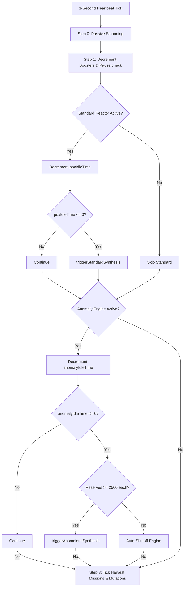

# P.O.X. Reactor & Anomaly Engine Loop Report

This report describes the technical design, mathematical algorithms, and state execution flow of the refactored DNA Synthesis Loop within the GENPOX Bio-Lab.

---

## 1. The Periodic Heartbeat Loop (Tick Engine)

The core orchestration of time-based processes in the Bio-Lab is governed by the `startReactorHeartbeat` function in [MainViewModel.kt](file:///c:/Users/brent/Antigravity/GENPOX/pox-android/app/src/main/java/com/example/genpox/ui/main/MainViewModel.kt#L2832-L3038).

### Execution Flow
- **Threading**: Runs on `Dispatchers.Default` using a background coroutine.
- **Tick Interval**: Runs continuously with a `delay(1000L)` loop (1-second intervals).
- **Core Ticking Operations**:
  1. **Passive Siphoning & Nutrient Accumulation**: Siphons environmental nucleotides every second to ensure the player can progress from 0 bases.
  2. **Reactor Boost Timers**: Decrements active boosters (which halve the synthesis cycle duration).
  3. **Standard P.O.X. Reactor Ticks**: Progresses the standard synthesis idle timer.
  4. **Anomaly Engine Ticks**: Progresses the unstable fusion timer.
  5. **Harvest Missions Ticks**: Updates active missions in the database, transitions phases, and rolls for environmental mutations.

---

## 2. Step 0: Environmental Nucleotide Siphoning

To solve the cold-start problem (where players begin with 0 bases/genes/creatures), the reactor passive loop accumulates raw nucleotides into stock buffers:
- **Baseline Accumulation**: Each base (`A`, `G`, `T`, `C`) accumulates at a base rate of `+10` units per tick.
- **Planetary Resonance (Daily Waves)**:
  - Daily planetary waves distort base generation based on solar/lunar alignments using `WaveMath.getDailyWaveConfig`.
  - When the daily wave is active (`!wave.isSuppressed`), the wave specifies a primary base ($p$) and a secondary base ($s$) along with their corresponding multipliers ($pm$, $sm$).
  - **Favored Bases**:
    - The primary base is multiplied by its wave multiplier: $\text{inc}_{p} = \text{round}(10 \cdot pm)$.
    - The secondary base is multiplied by its wave multiplier: $\text{inc}_{s} = \text{round}(10 \cdot sm)$.
  - **Stock Integration**: The siphoned yields are continuously added to the player's preferences stockpile: `rawStockA`, `rawStockG`, `rawStockT`, `rawStockC`.

---

## 3. Step 1: Standard P.O.X. Reactor (Standard Synthesis)

Standard gene synthesis is executed when `_poxIdleTime` hits zero inside `triggerStandardSynthesis`.

### Dynamic Cycle Time
The base cycle time depends on the active polymerase enzyme selected in the Chamber:
- **Taq Polymerase**: Fast (8 seconds cycle time).
- **Tth Polymerase**: Medium (16 seconds cycle time).
- **Pfu Polymerase**: Slow (24 seconds cycle time).
- **Reactor Booster**: Active booster timers halve these values (e.g., Taq cycles in 4 seconds).

### Synthesis Pipeline
1. **Candidate Generation**:
   Generates 8 candidate blocks of 8 bases each using the daily wave configuration and the player's raw stock inlet sliders ($I_A, I_G, I_T, I_C$):
   $$\text{Weight}_{B} = \text{WaveModifier}_B \times I_B$$
   Where $B \in \{A, G, T, C\}$. Bases are sampled probabilistically using these weights.
2. **Feedstock Depletion & Base Substitutions**:
   As the sequence is constructed, nucleotides are decremented from the raw stockpiles. If a stockpile is depleted mid-synthesis:
   - **Base Substitution**: The reactor automatically substitutes the depleted base with any other available base in stock.
   - **Absolute Fallback**: If all stockpiles are 0, it falls back to generating `A` without decrement.
   - **Phred Quality Penalty**: Any substituted block suffers a severe quality penalty (subtracts `-15.0` from the Phred Q-Score, down to a minimum of `5.0`).
3. **Biophysical Parameter Filtering**:
   For each completed 8-character sequence, thermodynamic parameters are calculated via [BiophysicsEngine.kt](file:///c:/Users/brent/Antigravity/GENPOX/pox-android/app/src/main/java/com/example/genpox/data/BiophysicsEngine.kt):
   - **GC Hairpin Stalling**:
     - *Trigger*: Temperature ($T_{\text{react}}$) $< 30^\circ\text{C}$ and Minimum Free Energy ($MFE$) $\le -5.0$ kcal/mol.
     - *Mitigation*: Adding **DMSO** solute prevents stalling.
     - *Failure*: If DMSO is absent, the sequence folds into a hairpin, stalling the polymerase. The sequence is scrambled (randomized), and the Q-Score drops to `5.0`.
   - **AT Denaturation**:
     - *Trigger*: Temperature ($T_{\text{react}}$) $> 75^\circ\text{C}$ and GC-content $< 40\%$.
     - *Mitigation*: Adding **Netropsin** solute protects AT bonds.
     - *Failure*: If Netropsin is absent, AT-rich strands denature (fall apart). The sequence is scrambled (randomized), and the Q-Score drops to `5.0`.
4. **Database Insertion & Packet Logging**:
   - The final sequences are stored in the Room Database. If a sequence already exists in the inventory, its `count` is incremented, and its `averageQScore` is updated as a running average.
   - A `GenePacket` is logged in the scrollable reactor feed.

---

## 4. Step 2: Anomaly Engine (Unstable Fusion)

The Anomaly Engine runs when engaged by the player, pausing the standard reactor.

### Resource Costs
- **Activation Threshold**: Requires at least 250,000 total nucleotides in stock.
- **Consumption Rate**: Consumes exactly **2,500 units of each base** (total 10,000 nucleotides) per cycle.

### Probability and Fusion Mechanics
1. **Cumulative Feedstock Consumption**: The engine tracks cumulative standard nucleotides consumed in the current active run (`_anomalyConsumedBases`).
2. **Success Chance Calculations**:
   - The success chance increases logarithmically with total consumed bases:
     $$\text{BaseChance} = \min\left(100.0, 5.0 + 8.0 \times \ln\left(1.0 + \frac{\text{ConsumedBases}}{10000.0}\right)\right)$$
   - Tuned by daily spectrum wave coupling $C_{\text{wave}}$ (derived from WaveMath):
     $$\text{FinalChance} = \text{BaseChance} \times C_{\text{wave}}$$
3. **Fusion Roll**:
   - **Success**: Generates an anomalous gene block (containing special characters `X`, `Y` or others). Anomalous fusion achieves perfect fidelity (average Q-Score fixed at `40.0`). The cumulative consumed counter resets to 0.
   - **Decay (Failure)**: The 10,000 consumed nucleotides decompose in the buffer, incrementing the cumulative counter.

---

## 5. Mathematical Formulations

The biophysical formulas implemented in [BiophysicsEngine.kt](file:///c:/Users/brent/Antigravity/GENPOX/pox-android/app/src/main/java/com/example/genpox/data/BiophysicsEngine.kt) are:

### Wallace-Breslauer Melting Temperature ($T_m$)
For short oligonucleotides, the melting temperature is calculated using the salt-corrected Wallace formula:
$$T_m = 2 \cdot N_{\text{AT}} + 4 \cdot N_{\text{GC}} - 16.6 \cdot \log_{10}\left(\frac{0.05}{[\text{Salt}]}\right)$$
Where:
- $N_{\text{AT}}$ is the count of AT bases in the sequence.
- $N_{\text{GC}}$ is the count of GC bases (and anomalous pairing equivalents).
- $[\text{Salt}]$ is the monovalent ion (salt) concentration in Molar.

### Nussinov Dynamic Programming ($MFE$)
The Minimum Free Energy (MFE) in kcal/mol is evaluated using a loop-state estimation algorithm. The DP table $dp[i][j]$ represents the minimum free energy of the sequence segment from index $i$ to $j$:
- Base pair energies: $\text{G-C} = -3.0$ kcal/mol, $\text{A-T} = -2.0$ kcal/mol, and anomalous pairing $\text{X-Y} = -4.0$ kcal/mol.
- **DP Recurrence**:
  $$dp[i][j] = \min \begin{cases} 
    dp[i+1][j] \\
    dp[i][j-1] \\
    dp[i+1][j-1] + \text{Energy}(seq[i], seq[j]) & \text{if pairable} \\
    \min_{i < mid < j} \left( dp[i][mid] + dp[mid+1][j] \right)
  \end{cases}$$
- Minimum loop size is constrained to 3 bases (width $k \ge 4$).

### Codon Adaptation Index ($CAI$)
Calculated for 64-character compiled creature genomes against the codon bias of their target faction:
- Factions have distinct base preferences: Infection ($A$), Mech ($G$), Parasite ($T$), Containment ($C$).
- Weights for triplets (codons) scale from $0.2$ (no preferred bases) to $1.0$ (3 preferred bases):
  $$w = 0.2 + 0.8 \cdot \frac{N_{\text{preferred}}}{3}$$
- The index is the geometric mean of the weights:
  $$CAI = \exp\left(\frac{1}{L} \sum_{i=1}^{L} \ln(w_i)\right)$$
  Where $L$ is the number of codons (21 codons for a 64-character sequence).

---

## 6. Splicing & Vault Recycling

- **Splicer (Constructor)**: Combines 8 standard/anomalous gene blocks into a 64-character genome, deducting the blocks from inventory and utilizing raw nucleotides as feedstock. The resulting creature's base stats scale with its CAI.
- **Vault (Recycling)**: Allows players to deconstruct accumulated standard gene blocks back into raw bases (each character $A, G, T, C$ yields $+1$ unit to its respective stock). Anomalous blocks cannot be decomposed.
