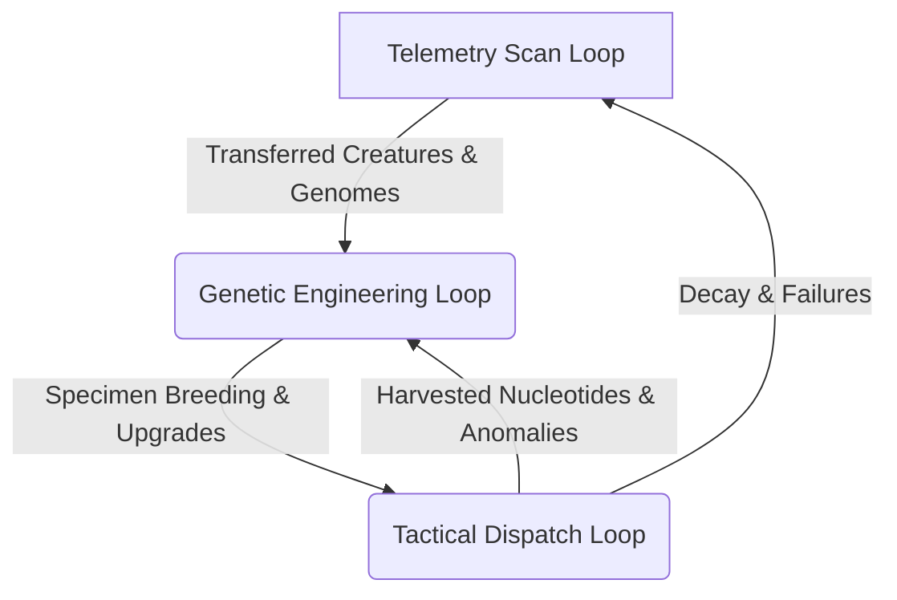
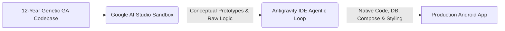

# GENPOX

GENPOX is a native Android location-based genetic research & hacking game with a cyber-retro/sci-fi aesthetic. Using the device's GPS and custom overlays, players scan, splice, combine, and hack creature genomes, dispatching drones on coordinates to harvest genetic materials, and upgrading reactors using specialized algorithms.

All interface elements are built with a terminal-inspired HUD aesthetic, featuring custom cyberglass borders, CRT scanline glitch simulations, and wireframe vector components.

---

## 🔁 Core Gameplay Loops

The gameplay in GENPOX is organized around three interconnected feedback loops:



### 1. The Telemetry Scan Loop (Physical-Digital Ingestion)
Players scan real-world QR codes using the mobile device's camera.
*   **Ingestion**: Powered by `CameraX` and `ML Kit Barcode Scanning` (configured to support QR codes).
*   **Result**: Decoded QR code payloads (Base64-encoded JSON) are parsed to transfer and compile creatures from other player nodes (saving them in the local database with $99\%$ telomeres). Additionally, raw 64-character DNA sequences or 8-character gene blocks can be scanned directly to compile new specimens or register genetic blocks in the player's stock.

### 2. The Genetic Engineering Loop (Bio-Lab Refinery)
Within the biological laboratory, players refine genetic sequences and breed specimens:
*   **Tide Pool Synthesis**: Refines standard nucleotides continuously using cycles modulated by real-world lunar age.
*   **Harmonization**: Fuses standard nucleotides into rare, anomalous gene blocks containing alien characters (`XZYW?!$%&@#`) with positive/negative probability waves.
*   **Gene Splicer**: Appends 8-character gene blocks to creatures. Extending sequences beyond the base 64 characters increases attributes and unlocks special movesets (Healing/Evasion).
*   **Maintenance**: Managing telomere length and preventing **Chromosomal Failure** (permanent deletion of a specimen upon reaching $0\%$ telomeres, returning $50\%$ of genetic blocks back to inventory).

### 3. The Tactical Dispatch Loop (Location-Based Harvest)
Players target geographical anomalies detected on the radar HUD derived from open-source maps:
*   **Radar HUD Exploration**: Move physically or simulate network link coordinates to lock onto overlapping anomaly centers.
*   **Harvester Deployment**: Dispatch compiled specimens on automated retrieval runs.
*   **Coordinate Penetration**: Harvesters traverse geographic distances, penetrate gravity wells, and extract targeted gene blocks.
*   **Real-time Telemetry**: Monitor mission status, travel phases, event logs, and sequence decay mutations occurring in transit before initiating recovery commands.

---

## ⚙️ Core Game Mechanics

### 1. Reactor Engine & Bio-Lab
*   **Tide Pool Reactor (`pox`)**: An automated, resource-free synthesizer compiling standard 8-base gene blocks. Runs on a $16$-second cycle ($8$ seconds if boosted). Daily output is governed by the active **Base-Pair Wave** matching the synodic moon phase.
*   **Genetic Anomaly Harmonizer (`anomaly`)**: An unstable, high-energy fusion chamber that consumes $10,000$ standard nucleotides ($1,250$ gene blocks) per loop, trying to create rare anomalous gene strings. Requires a safety reserve of $250,000$ nucleotides to operate.

### 2. Gene Splicer & Combinator
*   **Attributes**: Scale according to A, G, T, C density (Vitality, Attack, Defense, Speed, Telomeres).
*   **Splicing Extension**: Extending sequences beyond 64 characters unlocks Slot 1 (at $\ge 72$ chars) and Slot 2 (at $\ge 80$ chars) move slots, resolving into **Bio-Drain Repair**, **Micro-Phage Extraction**, **Quantum Escape Deviation**, or **Electromagnetic Shell Deflect**.
*   **Anomalous Benefits**: Anomalous characters grant passive buffs (like double strikes, health regeneration, or drag immunity) with specific trigger conditions (e.g. active only during dark moon phases or when Vitality drops below $40\%$).

### 3. Tactical Radar HUD
*   **Terrain Rendering**: Renders real-world road and building geometries parsed from pre-cached OpenStreetMap coordinates.
*   **2.5D Camera Projection**: Simulates a tilted HUD view. Includes perspective tilting, manual rotation, and variable zoom multipliers ($4.00\text{x}$ down to $0.25\text{x}$).
*   **Frustum Culling & simplified LOD**: Expansion of the culling radius along the tilt dimension prevents distant objects from popping out. Flat 2D rendering paths activate automatically when tilted flat or when building shapes are small to minimize GPU batch draw calls.
*   **Foreground Canvas Layering**: Active harvesters, target locks, and text markers are layered above building fills to prevent HUD occlusion.

### 4. Synth Soundscapes
*   **PoxSynthManager**: A native Kotlin audio synthesizer utilizing Android's low-level audio tracks. Generates frequency oscillators and pitch envelopes to play retro sci-fi alerts, synthesis beats, and system alarms dynamically without relying on external MP3/WAV assets.

---

## 🧮 Integrated Scientific & Mathematical Formulas

The underlying systems of GENPOX are driven by deterministic physical and astronomical equations:

### 1. Synodic Lunar Cycle & Wave Weights
The tide pool synthesis is synchronized with the synodic lunar cycle. The current lunar age is derived from standard epoch milliseconds:
*   **Reference New Moon ($T_0$)**: May 17, 2026, 01:54:00 UTC.
*   **Synodic Period ($L$)**: $29.53059\text{ days}$.
*   **Days Elapsed ($D$)**:
    $$D = \frac{\text{Current Time (ms)} - T_0}{86,400,000}$$
*   **Lunar Age ($A$)**:
    $$A = (D \bmod L + L) \bmod L$$

Based on the lunar age, the moon's angular phase determines the Primary ($m_1$) and Secondary ($m_2$) multipliers for nucleotide weights:
*   **Moon Angle ($\theta$)**:
    $$\theta = \frac{2\pi \cdot A}{L} - \frac{\pi}{2}$$
*   **Moon Modifier ($\delta$)**:
    $$\delta = 0.0125 \cdot \sin(\theta)$$
*   **Primary Wave Multiplier ($m_1$)**:
    $$m_1 = 1.125 + \delta$$
*   **Secondary Wave Multiplier ($m_2$)**:
    $$m_2 = 1.625 + \delta$$

> [!NOTE]
> If a deterministic date-hash yields $(Hash \bmod 100) < 50$, the wave is suppressed into a **Dormant State**, overriding the multipliers and enforcing a flat $25\%$ weight distribution.

### 2. Anomaly Harmonization Fusion Chance
The unstable fusion success probability ($FinalChance$) scales logarithmically and couples with daily sinusoidal waves:
*   **Base Chance ($BaseChance$)**: Locked to $1\%$ below $10,000$ nucleotides, and reaches $100\%$ at $250,000$ nucleotides:
    $$t = \frac{\ln(\text{Stockpile}) - \ln(10,000)}{\ln(250,000) - \ln(10,000)}$$
    $$BaseChance = 1.0 + 99.0 \cdot t$$
*   **Resonance Peak Boost ($PB$)**: Bell-curve peaks occur at multiples of $14\%$ ($P \in \{14, 28, 42, 56, 70, 84, 98\}$). If the distance $d = |BaseChance - P| < 5.0$:
    $$PB = 6.5 \cdot \exp\left(-\left(\frac{d}{1.8}\right)^2\right)$$
*   **Spectrum Wave Coupling ($S$)**: Daily sinusoidal modifier with a 6-hour cycle:
    $$S = 80.0 + 12.375 \cdot \sin(f_{\text{day}} \cdot 8\pi)$$
    $$HM = (S - 80.0) \times 0.25$$
    *(where $f_{\text{day}}$ is the elapsed fraction of the 24-hour day)*
*   **Final Success Chance ($FinalChance$)**:
    $$FinalChance = \operatorname{clamp}(BaseChance + PB + HM, 1.0\%, 100.0\%)$$

### 3. Anomalous Gene Coding & Raw Power
*   **Naming prefix & suffix**: Deterministic mapping of characters $s_0$ and $s_1$ (e.g. `Z?` becomes "Zero-Point Siphon").
*   **Raw Power ($RawPower$)**: Sum of character ratings in the middle indices ($s_2$ to $s_5$):
    $$RawPower = \sum_{i=2}^5 \operatorname{val}(s_i) \quad (\text{Range: } 4 \text{ to } 24)$$
    *(where `X, Z, Y, W` = 3; `?, !` = 4; `$, %` = 5; `&, @, #` = 6; others = 1)*
*   **Combat Benefit ID**: Determined by:
    $$EffectIndex = (\operatorname{code}(s_0) + \operatorname{code}(s_1)) \bmod 6$$
*   **Activation Condition**: Governed by the last two characters:
    $$TriggerIndex = (\operatorname{code}(s_6) + \operatorname{code}(s_7)) \bmod 8$$

### 4. Dispatch Physics & Transit Duration
When a specimen is sent on a harvest run, it travels to the anomaly's boundary, penetrates the gravity well, harvests the gene block, and returns:
*   **Effective Resistance ($R_{\text{anom}}$)**:
    $$R_{\text{anom}} = (R_{\text{boundary}} \times 0.1) \times \operatorname{mod}_{\text{resistance}}$$
    *(where $\operatorname{mod}_{\text{resistance}}$ ranges between $0.7$ and $1.3$ based on the lunar age cycle)*
*   **Stalled Depth ($Depth_{\text{stalled}}$)**: The depth percentage at which the specimen halts in the well:
    $$Depth_{\text{stalled}} = \operatorname{clamp}\left(\frac{\text{Creature.defense} + \operatorname{mod}_{\text{resonance}}}{R_{\text{anom}}} \times 100.0, 0.0, 100.0\right)$$
    $$d_{\text{dispatch}} = R_{\text{boundary}} \times \left(1.0 - \frac{Depth_{\text{stalled}}}{100.0}\right)$$
*   **Overlapping Gravity Wave Drag ($D_{\text{combined}}$)**: Cumulative interference from neighboring anomalies:
    $$D_{\text{combined}} = \sum_{j} \operatorname{density}_j \times \cos(0.02 \cdot d_j + \phi_j) \cdot e^{-0.002 d_j}$$
    $$D_{\text{eff\_density}} = \operatorname{clamp}(D_{\text{combined}} + 0.2 \cdot (\operatorname{scale}_{\text{lunar}} - 0.5), -0.33, 0.33)$$
    *(If the creature has a **Coherence Shield**, positive drag is completely negated)*
*   **Velocities**:
    *   Horizontal Travel Velocity: $V_{\text{travel}} = \text{Creature.speed} \times 13.5$
    *   Vertical Descent Velocity: $V_{\text{descent}} = V_{\text{travel}} \times \max(0.1, 1.0 - 2.0 \times D_{\text{eff\_density}}) \times 0.024$
*   **Durations (Seconds)**:
    *   Travel Time: $t_{\text{travel}} = \max\left(1, \operatorname{round}\left(\frac{\max(0, \text{Distance} - R_{\text{boundary}})}{V_{\text{travel}}}\right)\right)$
    *   Descent Time: $t_{\text{descent}} = \max\left(1, \operatorname{round}\left(\frac{R_{\text{boundary}} \times \frac{Depth_{\text{stalled}}}{100.0}}{V_{\text{descent}}}\right)\right)$
    *   Harvest Time: $t_{\text{harvest}} = 60\text{s}$ (static)
    *   Ascent Time: $t_{\text{ascent}} = t_{\text{descent}}$
    *   Return Time: $t_{\text{return}} = t_{\text{travel}}$
    *   Total Duration: $t_{\text{total}} = t_{\text{travel}} + t_{\text{descent}} + t_{\text{harvest}} + t_{\text{ascent}} + t_{\text{return}}$

### 5. Genetic Mutation Decay
During the `DESCENT`, `HARVEST`, and `ASCENT` phases inside the well, cosmic radiation induces mutations at deterministic intervals:
$$\Delta t_{\text{mutation}} = \max\left(1, \operatorname{round}\left( \frac{480.0 \times 2^{-\frac{Depth_{\text{stalled}}}{25.0}}}{\operatorname{mod}_{\text{mutation}} \times 16.0} \right)\right)$$
*Every $\Delta t_{\text{mutation}}$ seconds, a random nucleotide index in the genome is replaced. Base attributes are immediately recompiled.*

### 6. Attribute Scaling by Telomere Degradation
A creature's base attributes are degraded in real-time as its telomeres decay:
$$\text{Effective Stat} = \max\left(\text{MinBound}, \operatorname{round}\left(\text{Base Stat} \times \left(0.25 + 0.75 \times \frac{\text{Telomeres}}{100}\right)\right)\right)$$
*(where $\text{MinBound}$ is $10$ HP for Vitality, and $5$ rating for all other attributes)*

---

## 🛠️ Tech Stack & Design Decision: Why Kotlin?

Rather than developing GENPOX inside a traditional cross-platform game engine (e.g. Unity, Godot, or Unreal), we opted to build the application as a **fully native Kotlin Android App** using **Jetpack Compose**. The rationale is detailed below:

### 1. Battery & Memory Efficiency for Location-Based Play
Location-based games require GPS tracking and background tasks to run for extended periods. Game engines like Unity loop a heavy, dedicated C++ rendering thread that constantly repaints the entire screen ($30$–$60$ frames per second), draining battery rapidly. 
By utilizing Jetpack Compose's state-driven recomposition, GENPOX only draws vectors on the Canvas when states actually change. This reduces GPU overhead to near zero when the screen is static, dramatically preserving the device's battery life in the field.

### 2. High-Performance Native API Integration
Integrating camera overlays, hardware sensors, and ML engines inside a 3rd party game engine is complex and introduces JNI/interop lag. Native Kotlin allows:
*   **Direct CameraX Bindings**: Low-overhead frame analysis on the CPU/GPU.
*   **Google Play Services & Maps SDK**: Native map integration that doesn't need wrapper plugins or third-party mapping packages.
*   **ML Kit Barcode Scanner**: Direct, lightning-fast execution of Google's barcode analysis pipeline.

### 3. Background Services & Persistent Engines
A core part of the gameplay loop involves creatures traversing anomalies in the background. Traditional game engines are paused or killed by the Android OS when minimized. Native Kotlin handles:
*   **WorkManager & Foreground Services**: Safely processes background timers and triggers notifications even when the player exits the application.
*   **Room Database**: Native SQLite integration for efficient inventory management and transaction safety.
*   **DataStore Preferences**: Fast, async storage for application state.


---

## 🧠 Gemini Compilation & Offline Fallback Engine

When compiling a raw 64-character DNA sequence into a biological specimen, the game evaluates the sequence to generate its attributes, name, type, and sci-fi lore. This is done via two pathways:

### 1. Google Gemini AI Compiler (Online)
If a Gemini API key is configured, the app uses the `google-generativeai` SDK to call the `gemini-3.5-flash` model. 
*   **Purpose**: The AI model dynamically compiles the DNA sequence into creative sci-fi creature lore, descriptive profiles, unique classification types, and immersive creature names matching the sequence's base frequencies.
*   **Configuration**: The API key is entered directly in the app's settings dashboard UI and stored securely on-device using Jetpack DataStore Preferences. It does *not* need to be hardcoded in `local.properties`.

### 2. On-Board Deterministic Compiler (Offline Fallback)
If the Gemini API key is missing or the device is offline/receives an API error, the game automatically falls back to an on-board compiler.
*   **Faction Resolution**: Determined by counting the most frequent base in the first 64 characters:
    $$\text{Faction} = \operatorname{argmax}(A_{\text{count}}, G_{\text{count}}, T_{\text{count}}, C_{\text{count}})$$
*   **Procedural Attribute Scaling**: Base stats are calculated deterministically:
    *   **Vitality**: $100 + A_{\text{count}} \times 5$
    *   **Attack (Aggression)**: $20 + G_{\text{count}} \times 2$
    *   **Defense (Block Shells)**: $20 + C_{\text{count}} \times 2$
    *   **Speed (Speed Rate)**: $20 + T_{\text{count}} \times 2$
*   **Procedural Naming**: Seeding `java.util.Random` with the hash code of the sequence (`sequence.uppercase().hashCode()`) to generate faction-specific names (e.g. `Toxipod-XX` or `Chitin-Shell-XX`). Procedural wireframe vector graphics and colors are resolved dynamically based on these values.

---

## 💾 Data Persistence & Database Schema

GENPOX uses a SQLite database abstraction layer via **Jetpack Room** to handle persistent local game state, inventory, and telemetry logs:

1.  **`creatures` Table**:
    *   Stores compiled specimens, sequences, custom names, factions, scaled base attributes (HP, Attack, Defense, Speed), telomere status ($0-100\%$), coherence indicators, and locked/favorite flags.
2.  **`gene_sequences` Table**:
    *   Inventory of 8-character standard nucleotide blocks (composed of `A`, `G`, `T`, `C`) and rare anomalous blocks containing alien character variations (`XZYW?!$%&@#`) used for splicing and reactor runs.
3.  **`active_missions` Table**:
    *   Active dispatch state for harvesters. Stores coordinates, transit phases (`TRAVEL`, `DESCENT`, `HARVEST`, `ASCENT`, `RETURN`), remaining time, stalled depth, and current in-transit mutations.
4.  **`telemetry_logs` Table**:
    *   Historical logger of events received during anomaly traversals and reactor runs, styled in terminal alert overlays.


---

## 🛠️ Prototyping & Development Workflow

GENPOX is built using a dual-stage development loop, splitting experimental algorithmic research from strict native Android implementation:



### 1. The Prototyping Sandbox (Google AI Studio)
The foundation of GENPOX is built on over 12 years of legacy Genetic Algorithm (GA) codebase files. To push these algorithms deeper, ideas are first spun up and iterated within Google AI Studio:
*   **Purpose**: Rapid, high-level prototyping, payload structures exploration, and core mathematical model validation.
*   **Focus**: Purely technical. Conceptual under-the-hood mechanics are tested here in a "messy" sandbox, completely decoupled from Android framework constraints and styling rules. This allows for deep algorithmic discovery without the friction of compiling the full application.

### 2. Production Engineering (Antigravity IDE & Agentic AI)
Once a mechanic is mathematically validated, the code is ported to the **Antigravity IDE** to be recreated and hardened into the production Android application:
*   **Agentic Pairing**: Transitioning prototypes is coordinated through an Agentic AI pairing loop inside the workspace. The AI agent acts as a co-developer, translating raw algorithmic scripts into structured, Kotlin-native code.
*   **Android Constraints & Refinement**: The agentic environment enforces strict design parameters:
    *   Implementing persistence structures with Jetpack Room schemas.
    *   Drawing vector lines, HUD components, and tilt matrices inside Jetpack Compose `Canvas` layers.
    *   Structuring view states, audio track oscillators, and background WorkManager routines.
*   **Clean Implementation**: The separation of concerns keeps the production codebase clean, leaving the prototyping "mess" behind in AI Studio while ensuring the Android app remains stylized, modular, and performant.

---

## 📂 Repository Structure

*   📁 [pox-android](file:///c:/Users/brent/Antigravity/GENPOX/pox-android) - The core Android project module.
    *   📁 `app/src/main/java/com/example/genpox` - Kotlin implementation of screens, view models, database, and background services.
        *   📁 [audio](file:///c:/Users/brent/Antigravity/GENPOX/pox-android/app/src/main/java/com/example/genpox/audio) - Procedural audio engine (`PoxSynthManager.kt`).
        *   📁 [data](file:///c:/Users/brent/Antigravity/GENPOX/pox-android/app/src/main/java/com/example/genpox/data) - Room database configurations, models, settings, and formulas (`WaveMath.kt`).
        *   📁 [ui](file:///c:/Users/brent/Antigravity/GENPOX/pox-android/app/src/main/java/com/example/genpox/ui) - Composable screens, navigation files, and UI layout definitions.
        *   📁 [ui/components](file:///c:/Users/brent/Antigravity/GENPOX/pox-android/app/src/main/java/com/example/genpox/ui/components) - Custom drawing modules (holographic maps, wireframe vectors, canvas charts, and camera scanners).
    *   📁 `app/src/main/assets` - Pre-cached road maps and building geometries (`pre_cached_roads.json`).
*   📁 [Documentation](file:///c:/Users/brent/Antigravity/GENPOX/Documentation) - Detailed design standards, rules, and reference sheets.
    *   📄 [master_design_standards.md](file:///c:/Users/brent/Antigravity/GENPOX/Documentation/master_design_standards.md) - Theme, typography, and styling parameters.
    *   📄 [creature_types.md](file:///c:/Users/brent/Antigravity/GENPOX/Documentation/creature_types.md) - Procedural faction configurations and creature attributes.
    *   📄 [creature_handling.md](file:///c:/Users/brent/Antigravity/GENPOX/Documentation/creature_handling.md) - Specimen life loops, telomere decay, and dispatch rules.
    *   📄 [splicer_design.md](file:///c:/Users/brent/Antigravity/GENPOX/Documentation/splicer_design.md) - Combinator views and user experience details.
    *   📄 [bio_lab_design.md](file:///c:/Users/brent/Antigravity/GENPOX/Documentation/bio_lab_design.md) - Tide Pool & anomaly engine math formulas.
    *   📄 [scanner_design.md](file:///c:/Users/brent/Antigravity/GENPOX/Documentation/scanner_design.md) - Coordinate projections, culling algorithms, and dispatch physics.
*   📁 [scratch](file:///c:/Users/brent/Antigravity/GENPOX/scratch) - Development scripts and experimental scratchpads.

---

## 🛠️ Getting Started

### Prerequisites

*   **Java Development Kit (JDK)**: JDK 17 or higher.
*   **Android SDK**: Android Studio (Koala or newer recommended) or CLI command-line tools configured with SDK Platform support for API level 36.
*   **Node.js**: Required to execute helper road-caching scripts.

### Build and Run

1.  **Configure Environment**:
    Create a `pox-android/local.properties` file with your SDK paths and API keys:
    ```properties
    sdk.dir=/path/to/your/Android/sdk
    MAPS_API_KEY=your_google_maps_api_key
    ```
2.  **Compile Android App**:
    From the `pox-android` directory, run:
    ```bash
    ./gradlew assembleDebug
    ```
3.  **Run Tests**:
    ```bash
    ./gradlew test
    ```

## 🔌 Integrated Dependencies & Libraries

GENPOX is built on top of standard open-source tools:
*   **OpenStreetMap / Overpass API**: Geometrical datasets for road network profiling.
*   **Google Maps SDK for Android (`play-services-maps`)**: Background spatial tracking and tile providers.
*   **Maps Compose (`maps-compose`)**: Procedural map components mapped inside Jetpack Compose overlays.
*   **CameraX (`camerax`)**: Configured to capture raw camera frame streams for live analysis.
*   **ML Kit Barcode Scanning (`play-services-mlkit-barcode-scanning`)**: Real-time QR code decoding engine used to parse incoming player transfer data.
*   **ZXing (`zxing-core`)**: Offline vector QR code generator used to export and share creature profiles with other player nodes.
*   **Google AI SDK (`google-generativeai`)**: Directly connects to Gemini API models to compile DNA sequences into lore, creature profiles, and dynamic stat blocks.
*   **Jetpack Room (`room`)**: Object-relational mapping database supporting transactions.
*   **Jetpack DataStore (`datastore-preferences`)**: Persistent key-value settings.
*   **Android Graphics Path (`androidx-graphics-path`)**: Force 16 KB page-aligned graphic layouts.
